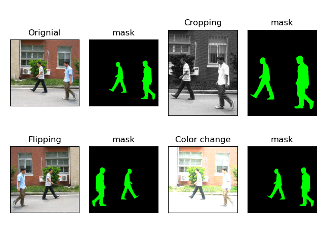
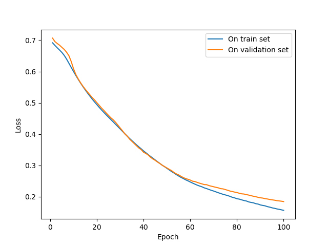
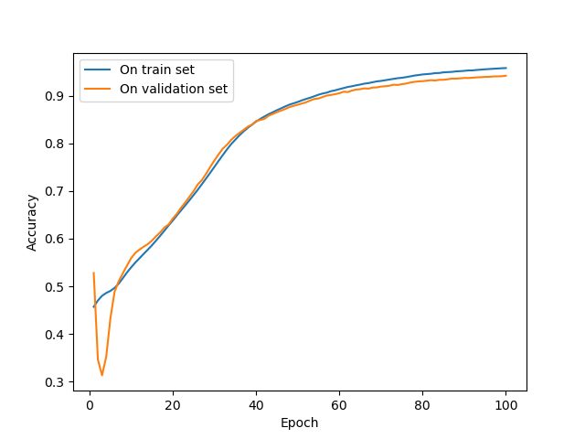
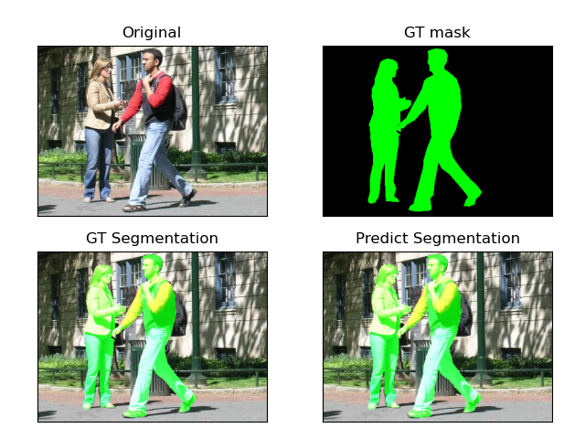
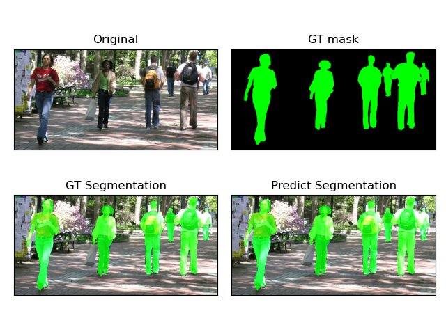

# Pedestrian-Segmentation   

Pedestrian segmentation by using U-Net model.  
Dataset: https://www.cis.upenn.edu/~jshi/ped_html/  
U-Net [paper.](https://arxiv.org/pdf/1505.04597.pdf)

## PennFudanAugmentation

Augmentation methods include resizing,cropping,flipping,color change,etc.

## Trainning

## SegmentationEffect

